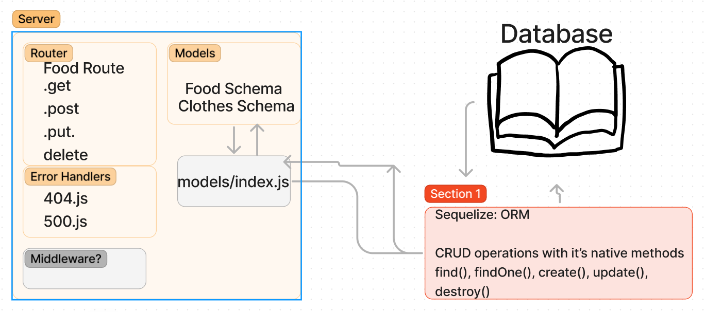

# LAB - Class 02

## Project: API Server

### Author: Mike Pace

### Problem Domain  

Build a REST API using Express, by creating a proper series of endpoints that perform CRUD operations on a Postgres SQL Database, using the REST standard.

### Links and Resources

- [GitHub Actions ci/cd](https://github.com/catdude2000/api-server/actions)
// change--------------
- [back-end dev server url](https://api-server-basic.onrender.com/)
- [back-end prod server url](http://xyz.com)

### Collaborators

### Setup

#### `.env` requirements (where applicable)

port variable exists within the env sample

#### How to initialize/run your application (where applicable)

clone repo, `npm i`, then run `nodemon` in the terminal

#### Routes

// change--------------
- GET : `/success` - specific route to hit

#### Tests

to run tests, after running `npm i`, run the command `npm test`

#### UML

// change----------------------

